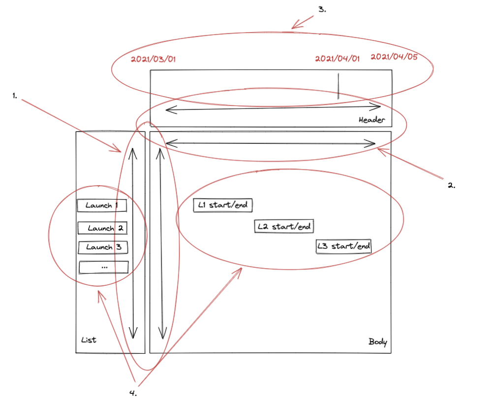

Thank you for taking time to complete our React tech task.

The goal of this task is to share your knowledge around building user facing applications, specifically using React. The most important aspect of the task is to demonstrate your own understanding and implementation of best practices.

Once you are happy with your project, please share a link to where we can view the codebase, with instructions on how to install/run the application on a README. Please use GIT for version control.

## General:
**Level:** Mid-Frontend Engineer

**Time-frame:** Maximum 1 week (note: the challenge is to share your knowledge, not how much of the challenge you complete)

**Recommended Stack:** React (required), Typescript

**Sharing:** GitHub (preferred)

## Story:
As a rocket scheduler, I would like to see the current schedule, so I can plan more rocket launches.

## Product Requirements (not in priority order):
1. A user should be able to scroll up and down, where the List and the Body containers scroll in sync
2. A user should be able to scroll left and right, where the Header and the Body containers scroll in sync
3. A user should be able to know where in time (date), they are viewing the schedule
4. A user should be able to see the rocket launch schedule
5. A user should be able to schedule new rocket launch(s)

## Technical Recommendations:

- Using packages/libraries are fine where consideration is made
- You can find available SpaceX API for launches here
- Routes:
  - `/launches`
  - `/launches/new`

